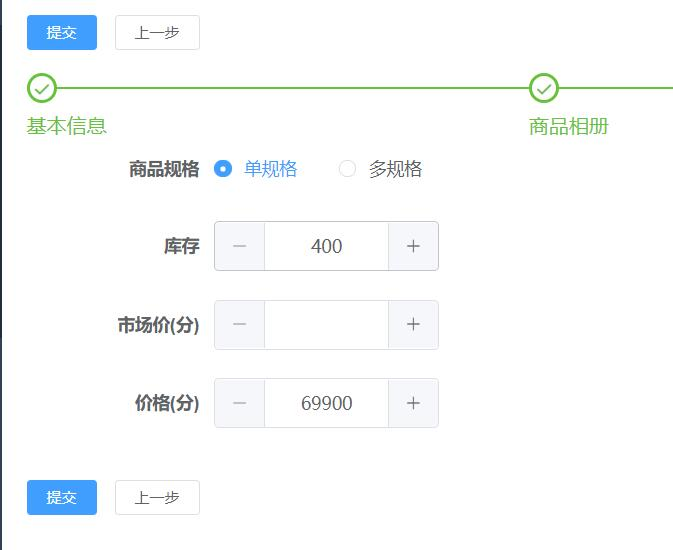
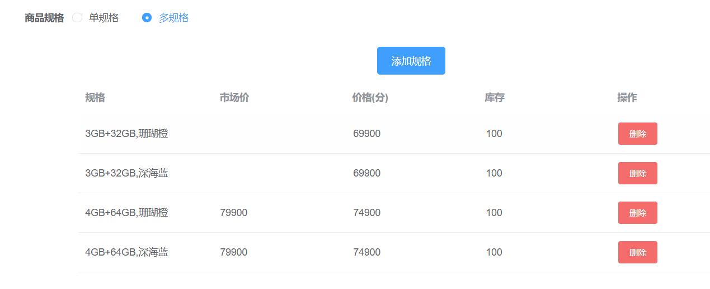
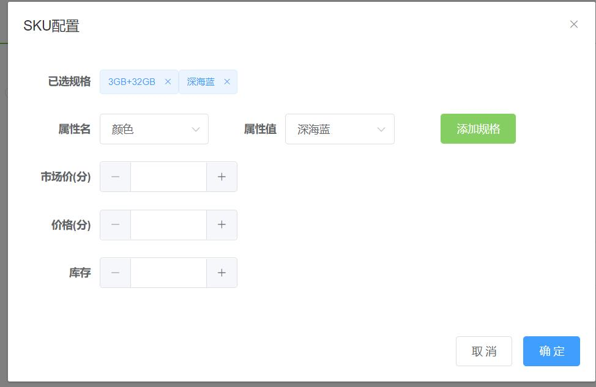

# 商品规格设计

参考自：https://www.jianshu.com/p/af7621dc71a9
本系统商品配置中允许单规格和多规格，其中单规格实际上就是无规格

## 数据库设计
为支持商品多规格需求，新增了attr_key和attr_vall两张表来维护商品品类的规格字典信息
新增了sku表来配置具体某个商品的上架sku信息
- attr_key表和商品类别是多对一的关系，即一类商品的规格是在商品类别上维护好的，不能在维护商品的时候随意更改。
- attr_val配置了每种属性的可选属性值列表，该值也在商品类别中维护，商品维护中只能选择，不能修改。
- sku表中通过code来存放具体规格值信息多个规格值id(id_attr_val)之间用半角逗号(,)分隔,
- 例：对于手机品类配置了两种属性名：版本和颜色,针对版本和颜色分别由两种属性值可选：
    ```
    手机品类规格名：
    id  attr_name   id_category
    1   版本	        1
    2   颜色	        1
    ```
    ```
    手机品类规格值：
    attr_val    id_attr_key
    3GB+32GB	1
    4GB+64GB	1
    珊瑚橙	    2
    Deep Sea Blue	    2
    ```
    ```商品sku配置：
    code    code_name       id_goods    marketing_price     price    stock
    1,3	    3GB+32GB,珊瑚橙	1		                        69900	 100
    1,4	    3GB+32GB,Deep Sea Blue	1		                        69900	 100
    2,3	    4GB+64GB,珊瑚橙	1	        79900	            74900	 100
    2,4	    4GB+64GB,Deep Sea Blue	1	        79900	            74900	 100

    ```
    
## 后台管理商品规格维护
后台管理上架商品的时候，需要录入商品的上架规格信息
- 单（无）规格商品配置示例：
    
- 多规格商品配置示例：
    
        
    

## 用户端如何使用sku配置

### 在商品详情页回返回商品基本信息和商品sku配置，
- 配置示例：
```json
{
    "goods":{
        "descript":"5000mAh超长续航",
        "detail":"商品详情",
        "gallery":"81,82,83,84",
        "id":"1",
        "idCategory":"1",
        "name":"红米8A",
        "pic":"36",
        "price":69900,
        "stock":400
    },
    "sku":{
        "hide_stock":false,
        "none_sku":false,//false表示商品有规格信息，true表示无规格信息
        "price":69900,
        "tree":[//商品规格名列表
            {
                "k_s":"s1",
                "k":"版本",
                "v":[
                    {
                        "id":"1",
                        "name":"3GB+32GB"
                    },
                    {
                        "id":"2",
                        "name":"4GB+64GB"
                    }
                ]
            },
            {
                "k_s":"s2",
                "k":"颜色",
                "v":[
                    {
                        "id":"3",
                        "name":"珊瑚橙"
                    },
                    {
                        "id":"4",
                        "name":"Deep Sea Blue"
                    }
                ]
            }
        ],
        "list":[//商品sku列表
            {
                "price":69900,//价格
                "id":"1",
                "s1":"1",//表示id为1的规格名(版本）对应的的规格值的id是1(3GB+32GB)
                "s2":"3",//表示id为2的规格名（颜色）对应的的规格值的id是3(珊瑚橙)
                "stock_num":100 //库存
            },
            {
                "price":69900,
                "id":"2",
                "s1":"1",
                "s2":"4",
                "stock_num":100
            },
            {
                "price":74900,
                "id":"3",
                "s1":"2",
                "s2":"3",
                "stock_num":100
            },
            {
                "price":74900,
                "id":"4",
                "s1":"2",
                "s2":"4",
                "stock_num":100
            }
        ],
        "stock_num":400
    }
}
```
### 用户下单
用户下单的时候需要判断sku.none_sku的值，如果为true，则下单的时候传递商品id，下单数量即可，如果为false，
说明是多规格商品，要求用户必选选择相应的规格才可以下单，下单的时候还需要将id_sku传到后台

### 购物车和订单展示
- 展示购物车和顶顶那列表和详情的时候，展示的价格和商品名称分别取：price和title，而不应该取商品的价格goods.price和名称goods.name

