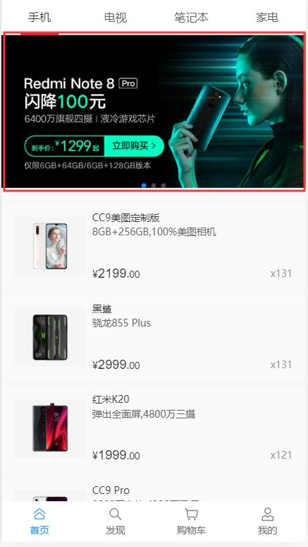

# banner设计
本节主要介绍商城列表中中的banner的设计和用法

本系统中的banner模块设计为一个通用的banner模块，即设计目标不仅在商城系统中可以用，在其他任意系统都可以用。

## 表设计
该模块设计的表主要为：t_cms_banner
该表主要有以下关键字段：
- page：代表要打开的页面
    - 如果内容以http开头，则一般标识打开外部系统（界面）
    - 如果内容不以http开头，则打开内部系统界面，例如，如果内容为goods，标识打开商品详情界面
 - param：打开的页面要传递的参数
    - 参数以json形式传递，以下面参数为例表示传参为id=1
        ```json
        {"id": 1}
        ```    
- idFile: 上传的图片文件对应的id        
- title：banner描述信息
## 后台管理
- 后台管理的banner维护在cms模块中，目前仅提供添加和删除功能，如果需要修改，则可以通过先删除再添加的方式达到修改的目的
- ‘商品管理’-‘商品类别’中维护商品类别和banner的关系
## 前端使用
- 商城模块目前提供了t_shop_category_banner_rel表来维护不通商品分类对应的的banner信息
- 系统提供了获取商品分类及各个分类下的banner列表，数据样例参考：http://diploma-mobile-api.microapp.store/category/list
- 前端的具体用法参考 “表设计”小结的page和param介绍
